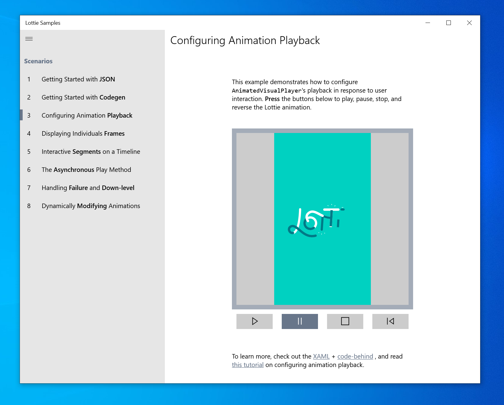

# Lottie Samples
The Lottie Samples project generates a [Store application](https://aka.ms/lottiesamples) that explains scenarios and concepts covered in the [Lottie-Windows Tutorials](https://docs.microsoft.com/en-us/windows/communitytoolkit/animations/lottie#tutorials) to help users get started with Lottie-Windows:

